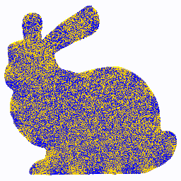

# Walk-on-Boundary Toolbox
This is a reference CUDA/OpenMP implementation of our SIGGRAPH North America 2023 paper, ["A Practical Walk-on-Boundary Method for Boundary Value Problems"](https://rsugimoto.net/WoBforBVPsProject/), Sugimoto, Chen, Jiang, Batty, and Hachisuka. 2023.
This repository contains implementations for key examples similar to the ones in the paper. Note this repository does not contain advanced examples like MCMC, nor general exterior Dirichlet problem solvers described in the paper.

The "simple_wob" example generates this image sequence.

## Directory Structure
- `wob`: The main header-only WoB Toolbox library which implements the core of the WoB method. Here are some brief descriptions of the main files.
  - `equation_kernel.cuh`: implementation of fundamental solutions for Poisson's equation.
  - `bie_models.cuh`: implementation of BIE models, including single-layer indirect BIE, double-layer indirect BIE, and direct BIE.
  - `scene.cuh`: implementation of sampling queries.
  - `estimator.cuh`: implementation of the standard backward or forward estimators. The choice of the specific sampling strategy for each problem is in this file, too.
- `apps`: contains .cu files with main functions.
- `data`: contains scene configuration JSON files and geometry .obj files.
- `deps`: contains dependency libraries.

## Dependencies
All dependencies are included as git submodules:

        git clone --recurse-submodules  https://github.com/rsugimoto/WoBToolbox

This repository utilizes the following external libraries.
- [Eigen](https://eigen.tuxfamily.org/): a header-only linear algebra library with CUDA kernel support.
- [rsugimoto/lbvh](https://github.com/rsugimoto/lbvh): a header-only CUDA BVH library, originally by [ToruNiina](https://github.com/ToruNiina/lbvh). The author (rsugimoto) modified it to support 2D queries and line intersection queries in addition to the originally supported queries.
- [nlohmann/json](https://github.com/nlohmann/json): a header-only C++ JSON parser.
- [libigl](https://github.com/libigl/libigl): a collection of common mesh operations.
- [NVIDIA/thrust](https://github.com/NVIDIA/thrust): a template utility library for CUDA. When available, the local version of Thrust shipped with CUDA is used. When CUDA installation is not found, the copy in `deps` directory is used to enable computation with OpenMP backend instead.

## Environment
The program is tested on Linux and Apple Silicon Mac machines with CUDA 12.1 or OpenMP enabled. The program is mainly targeted at machines with CUDA with a C++17 compiler installed, but it works on CPUs with OpenMP backend using a C++20 compiler, too.

The program is untested on Windows machines. Since Eigen is used with CUDA, [the compilation may fail with NVCC with MS Visual Studio](https://eigen.tuxfamily.org/dox/TopicCUDA.html).

## Compile and Run
Compile this project using the standard cmake routine:

    mkdir build
    cd build
    cmake -DCMAKE_BUILD_TYPE=Release ..
    make

This will make several executable files in the `build` directory. The compilation may take a few minutes if CUDA is found. You can run programs from the project directory with a required JSON configuration file, for example:

    build/simple_wob_and_wos data/config_simple_wob.json

The program generates outputs under the directory (e.g. `results/simple_wob/raw_data`) as specified in the JSON file, in a binary format. Note that the number of samples per iteration must be adjusted with the `num_sample_paths` parameter in the JSON file based on the spec of your hardware to prevent getting too many output files or taking too long per iteration. The program terminates when the time exceeds `max_time` minute(s) after each iteration.

Once you get the outputs, you can run a visualization Python script, for example:

    python visualize.py results/simple_wob

The resulting png files will be saved in the same folder (e.g. `results/simple_wob/render`). Other executables in `build` should be run with the configuration files with matching names.